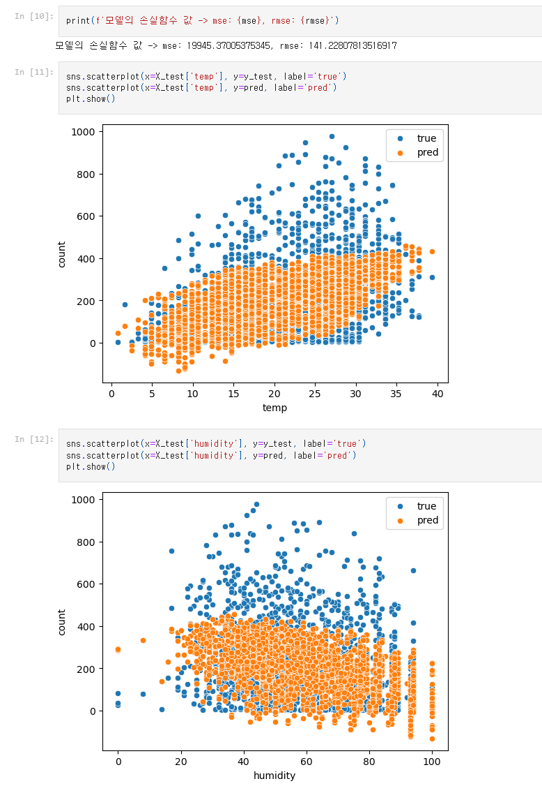
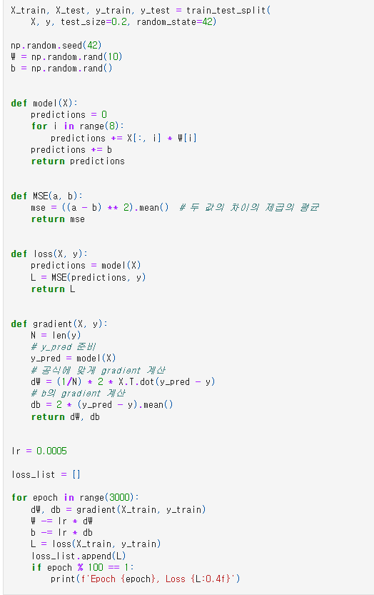
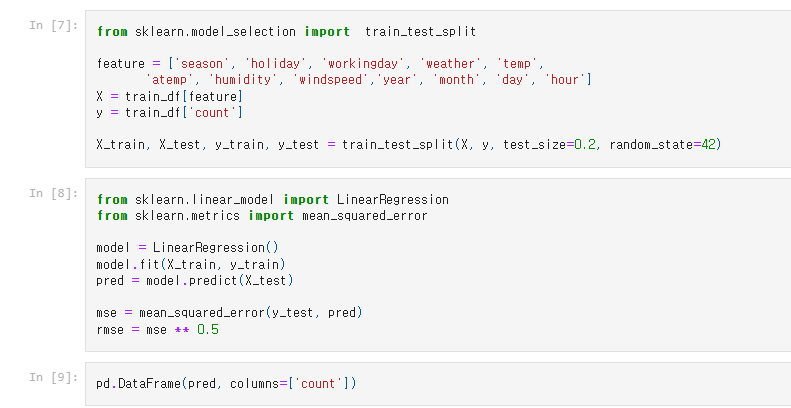
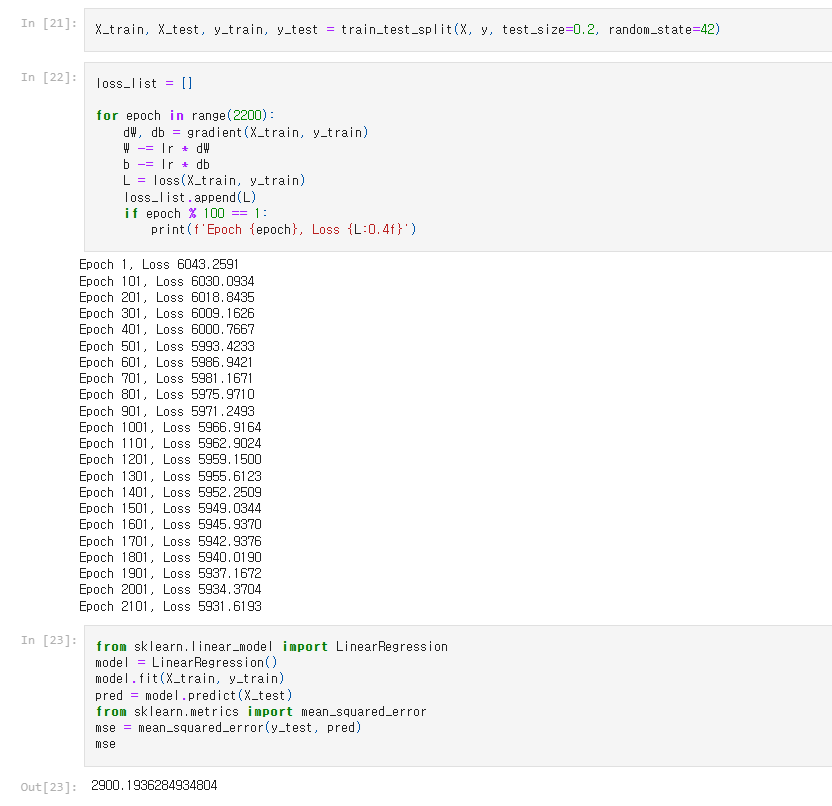
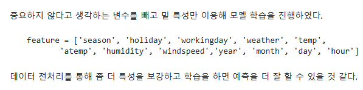
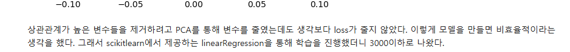
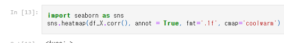
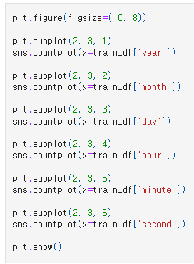

# AIFFEL Campus Online Code Peer Review Templete
- 코더 : 김희찬
- 리뷰어 : 김영민


# PRT(Peer Review Template)
- [x]  **1. 주어진 문제를 해결하는 완성된 코드가 제출되었나요?**
    - 문제에서 요구하는 최종 결과물이 첨부되었는지 확인
        - 중요! 해당 조건을 만족하는 부분을 캡쳐해 근거로 첨부
        
        
        
    
- [x]  **2. 전체 코드에서 가장 핵심적이거나 가장 복잡하고 이해하기 어려운 부분에 작성된 
주석 또는 doc string을 보고 해당 코드가 잘 이해되었나요?**
    - 해당 코드 블럭을 왜 핵심적이라고 생각하는지 확인
    - 해당 코드 블럭에 doc string/annotation이 달려 있는지 확인
    - 해당 코드의 기능, 존재 이유, 작동 원리 등을 기술했는지 확인
    - 주석을 보고 코드 이해가 잘 되었는지 확인
        - 중요! 잘 작성되었다고 생각되는 부분을 캡쳐해 근거로 첨부
    
    먼저 모델과 loss함수, 그리고 gradient함수가 모두 들어가 있는 부분이기 때문에 핵심적인 부분이라고 생각했고 또 주석또한 잘 적혀 있습니다.
    해당 부분은 loss의 기울기를 계산해 경사하강법으로 학습하는 부분이 담겨있습니다.
    
    이부분은 feature선정과 train_test_split, 그리고 LinearRegression이 모두 들어있는 부분으로 가장 핵심이라고 생각하고 주석이 없지만 간결한 코드로
    이해하기 문제가 없습니다.
        
- [x]  **3. 에러가 난 부분을 디버깅하여 문제를 해결한 기록을 남겼거나
새로운 시도 또는 추가 실험을 수행해봤나요?**
    - 문제 원인 및 해결 과정을 잘 기록하였는지 확인
    - 프로젝트 평가 기준에 더해 추가적으로 수행한 나만의 시도, 
    실험이 기록되어 있는지 확인
        - 중요! 잘 작성되었다고 생각되는 부분을 캡쳐해 근거로 첨부
    
    사이킷런의 LinearRegression을 사용해보기도 하고 다른 하이퍼 파라미터를 사용해보기도 하는 등 여러 시도를 했습니다.
    
    feature를 재선정하여 진행하였습니다.
        
- [x]  **4. 회고를 잘 작성했나요?**
    - 주어진 문제를 해결하는 완성된 코드 내지 프로젝트 결과물에 대해
    배운점과 아쉬운점, 느낀점 등이 기록되어 있는지 확인
    - 전체 코드 실행 플로우를 그래프로 그려서 이해를 돕고 있는지 확인
        - 중요! 잘 작성되었다고 생각되는 부분을 캡쳐해 근거로 첨부
    
    전체적인 요약과 결과에 대한 회고가 잘 작성되어 있습니다.
    
    느낀점과 아쉬운점이 적혀있고 이를 토대로 새로운 시도를 해본다면 좋을것 같습니다.
        
- [x]  **5. 코드가 간결하고 효율적인가요?**
    - 파이썬 스타일 가이드 (PEP8) 를 준수하였는지 확인
    - 코드 중복을 최소화하고 범용적으로 사용할 수 있도록 함수화/모듈화했는지 확인
        - 중요! 잘 작성되었다고 생각되는 부분을 캡쳐해 근거로 첨부
    
    히트맵을 사용해본 부분이 인상 깊었습니다.
    
    플롯을 간결하게 잘 사용한 것이 인상적이었습니다.


# 회고(참고 링크 및 코드 개선)
```
# 리뷰어의 회고를 작성합니다.
# 코드 리뷰 시 참고한 링크가 있다면 링크와 간략한 설명을 첨부합니다.
# 코드 리뷰를 통해 개선한 코드가 있다면 코드와 간략한 설명을 첨부합니다.

#sns.countplot(x='year', data=train, ax=axs[0, 0])와 같이 작성한다면 색이 자동으로 첨부되어 더 가독성좋은 그래프가 될거같습니다.
#그리고 plot의 사이즈가 조절되지않아 글자가 뭉개져 보이는 것이 있는데 플롯 사이즈 조절이 된다면 좋을거같습니다 ex)figsize=(15, 15)
```
