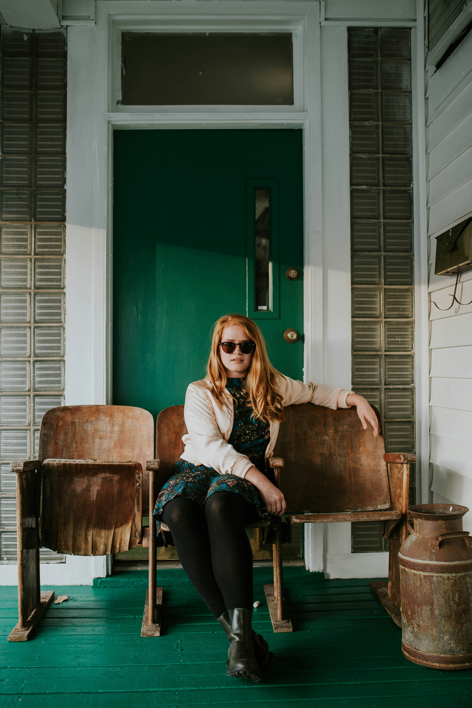
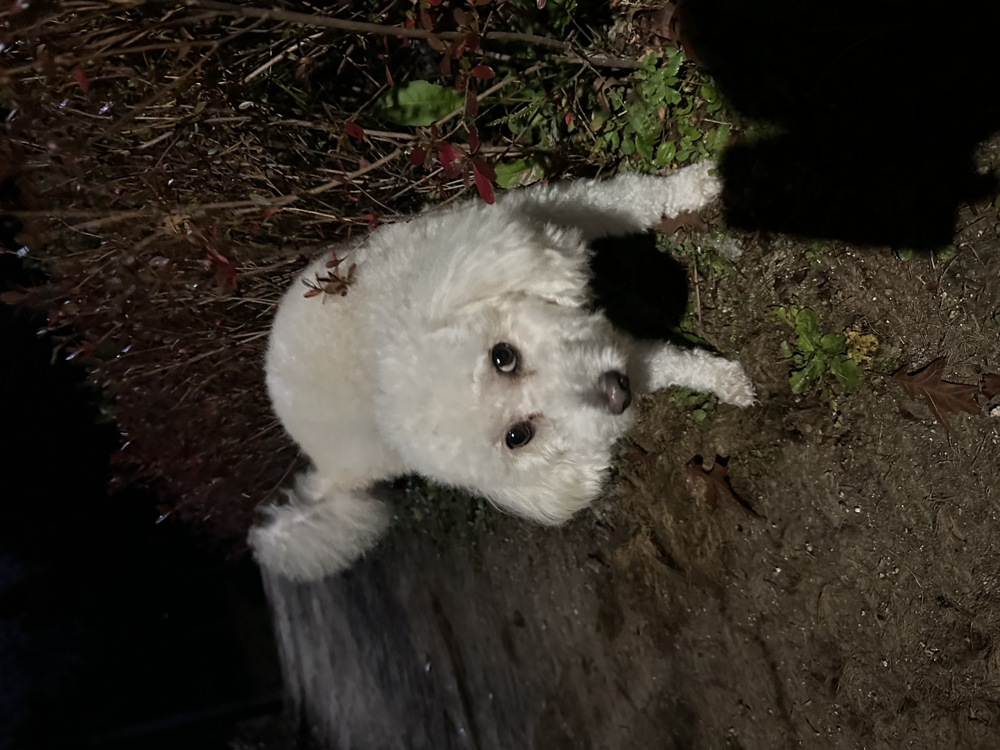
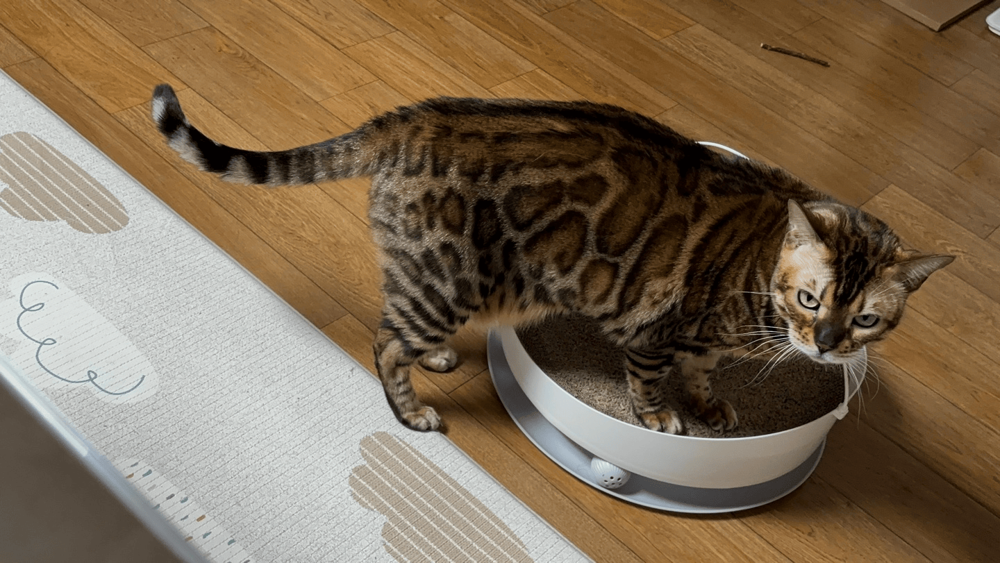
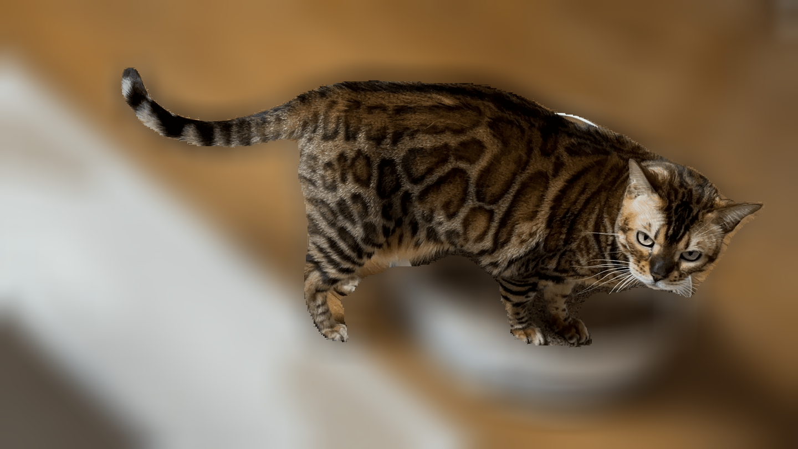
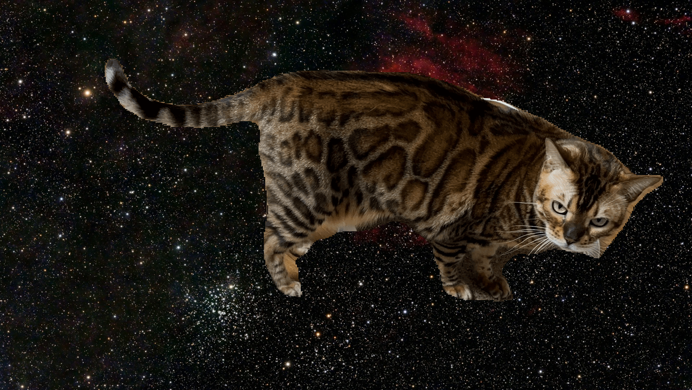
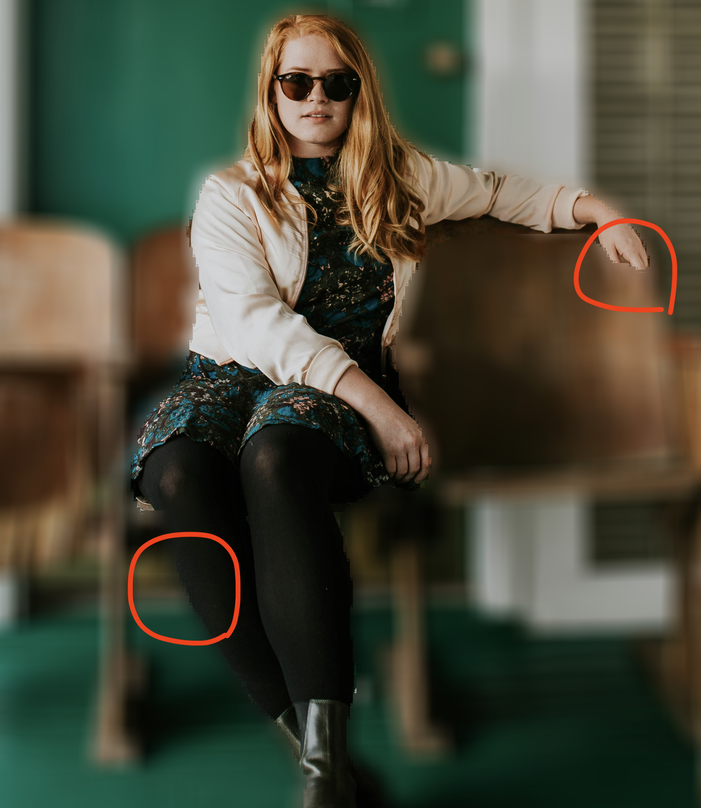

# 평가문항
## 1. 인물모드 사진을 성공적으로 제작하였다

images/image_change 디렉토리에 제작한 파일을 두었습니다.

종류 | 원본 사진 | 블러처리 | 크로마키 | 
|----|----|----|----|
|인물|||
|강아지 사진|||
|고양이 사진1|||
|고양이 사진2|||

## 2. 제작한 인물모드 사진들에서 나타나는 문제점을 정확히 지적하였다.

베이스라인 코드에서의 문제점은 다음과 같습니다.

제작한 인물모드 사진의 문제점은 다음과 같습니다.     
사진을 자세히 보면 손이 잘려있고, 왼쪽 정강이쪽에 실제로 사람이미지인데 블러 처리가 되어버린 문제점을 볼 수 있습니다.

## 3. 인물모드 사진의 문제점을 개선할 수 있는 솔루션을 적절히 제시하였다.

위 인물 사진의 문제점은 모델 정확도가 100%가 아닌 이상 필연적으로 발생할 수 밖에 없는 문제라 실은 완벽히 구현하기 힘듭니다.

이 문제를 개선하기 위해 CRF(Conditional Random Field)을 적용하는 방법을 제안합니다.

CRF(Conditional Random Field)는 조건부 확률 모델로, 주어진 입력 데이터와 그 데이터 간의 관계를 기반으로 레이블링 문제를 해결하는 데 사용됩니다. 특히, 시퀀스 데이터 또는 공간적으로 연관된 데이터를 다룰 때 유용합니다.     
- CRF의 주요 개념    
  1. 조건부 확률 모델
  2. 마르코프 네트워크 기반
  3. 전역 최적화

- 왜 CRF를 사용해야 하는가?     
semantic segmentation은 픽셀 단위의 조밀한 예측이 필요한데, classification 네트워크를 기반으로 segmentation network를 구성하게 되면 feature map의 크기가 줄어들기 때문에 세부 정보가 소멸된다는 문제가 존재합니다. 하지만 CRF는 전역 최적화를 통해 이 문제를 보완합니다. (경계 강화, 노이즈 제거)

즉, CRF를 통해서 작은 객체의 레이블링 정확도 향상, 픽셀 단위의 경계선 정확도 개선, 모델이 직접 처리하기 어려운 전역적 관계를 보완할 수 있습니다.

PipeLine    
DeepLab 모델 적용 -> CRF 처리 -> 최종 출력

[참고 자료]    
https://ratsgo.github.io/machine%20learning/2017/11/10/CRF/    
https://m.blog.naver.com/laonple/221017461464